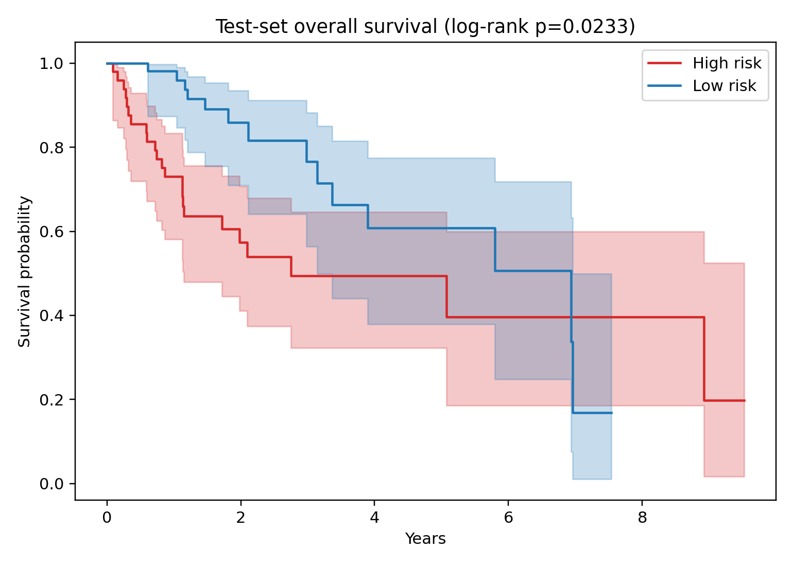
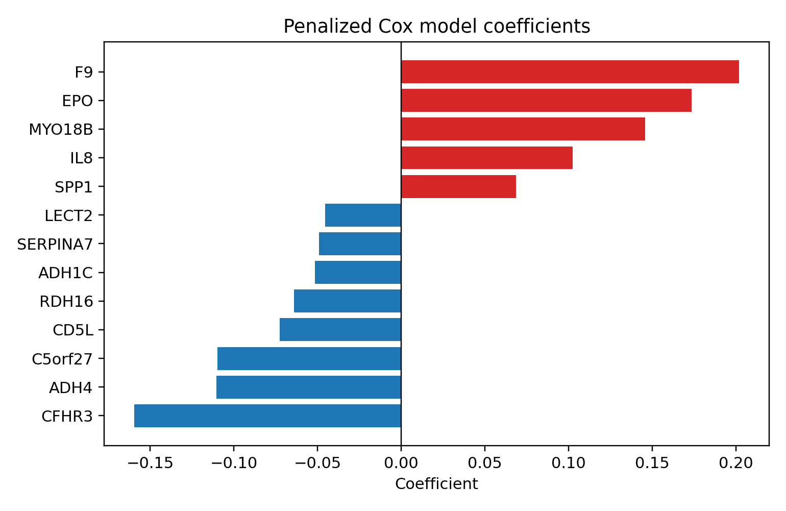

# TCGA-LIHC Gene-Expression Survival Risk Model

An independently developed, reproducible analysis of public TCGA liver
hepatocellular carcinoma data. The project builds an interpretable
gene-expression risk signature and evaluates it on a held-out test cohort.



## Project Question

Can tumor gene expression stratify hepatocellular carcinoma patients into
groups with different overall-survival outcomes?

## Cohort And Validation Design

- Public TCGA-LIHC RNA expression and clinical data from the UCSC Xena hub
- 342 primary-tumor patients with usable overall-survival data
- 123 observed death events
- Stratified 70/30 split: 239 training patients and 103 held-out test patients
- All gene screening, scaling, and model selection performed using training
  data
- Five-fold cross-validation used to tune the penalized Cox model

## Analysis Workflow

1. Match primary-tumor expression profiles to patient survival records.
2. Select high-variance genes using training data.
3. Screen candidate genes with training-set log-rank tests.
4. Fit an L1-regularized Cox proportional-hazards model.
5. Select an interpretable model using cross-validation.
6. Apply the fixed model and training-derived risk threshold to the test set.

## Key Results

- Final signature: **13 genes**
- Held-out test-set concordance index: **0.751**
- Test-set high-risk versus low-risk log-rank p-value: **0.023**
- Test risk groups: 49 high-risk and 54 low-risk patients

Positive model coefficients, including **F9**, **EPO**, **MYO18B**, **IL8**, and
**SPP1**, were associated with higher predicted risk. Negative coefficients,
including **CFHR3**, **ADH4**, and **RDH16**, were associated with lower
predicted risk.



## Repository Structure

```text
.
|-- src/
|   |-- download_data.py
|   `-- run_analysis.py
|-- results/
|   |-- figures/
|   |-- tables/
|   `-- summary.json
|-- .gitignore
|-- README.md
`-- requirements.txt
```

## Reproduce The Analysis

```bash
pip install -r requirements.txt
python src/download_data.py
python src/run_analysis.py
```

Raw patient-level data are intentionally excluded from the repository.

## Limitations

- This is an internal validation using one held-out TCGA split; external cohort
  validation is required.
- Gene screening and model selection can be sensitive to cohort composition.
- Clinical covariates were not incorporated into the expression-only model.
- Results are exploratory and must not be used for clinical decision-making.

## Data Source

The project uses publicly available TCGA-LIHC data distributed through the
[UCSC Xena platform](https://xenabrowser.net/datapages/).

## Tools

Python, pandas, scikit-learn, lifelines, Matplotlib, penalized Cox regression,
survival analysis.

